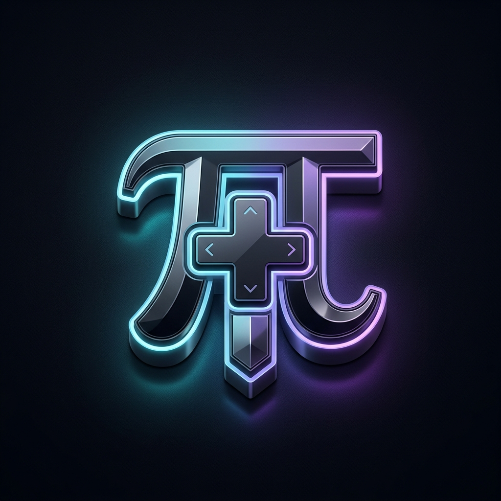

# Pi Game Studio

<p align="center">
  
</p>

<p align="center">
  Turn a Pi session into a full game development studio.
  <br />
  55 agents. 80 skills. 49 templates. One coordinated AI team.
</p>

<p align="center">
  <a href="LICENSE"></a>
  <a href="agents"></a>
  <a href="skills"></a>
  <a href="prompts"></a>
  <a href="chains"></a>
  <a href="starters"></a>
  <a href="extensions"></a>
  
</p>

---

## Why This Exists

Building a game solo with AI is powerful — but a single chat session has no structure. No one stops you from hardcoding magic numbers, skipping design docs, or writing spaghetti code. There's no QA pass, no design review, no one asking "does this actually fit the game's vision?"

**Pi Game Studio** solves this by giving your AI session the structure of a real studio. Instead of one general-purpose assistant, you get 55 specialized agents organized into a studio hierarchy — directors who guard the vision, department leads who own their domains, and specialists who do the hands-on work. Each agent has defined responsibilities, escalation paths, and quality gates.

The result: you still make every decision, but now you have a team that asks the right questions, catches mistakes early, and keeps your project organized from first brainstorm to launch.

---

## Table of Contents

- [What's Included](#whats-included)
- [Key Mappings (CCGS → Pi)](#key-mappings-ccgs--pi)
- [Studio Hierarchy](#studio-hierarchy)
- [Model Mapping](#model-mapping)
- [Customizing Models](#customizing-models)
- [Slash Commands](#slash-commands)
- [Getting Started](#getting-started)
- [Project Structure](#project-structure)
- [How It Works](#how-it-works)
- [Design Philosophy](#design-philosophy)
- [Source & Credits](#source--credits)
- [License](#license)

---

## What's Included

| Category      | Count | Description                                                                                                              |
| ------------- | ----- | ------------------------------------------------------------------------------------------------------------------------ |
| **Agents**    | 55    | Specialized agents across design, programming, art, audio, narrative, QA, and production                                 |
| **Subagents** | Native| Isolated child process execution via `subagent_run`, `subagent_list`, `subagent_status` & `subagent_result`              |
| **Interactive**| Native| Interactive terminal menus & batch questionnaires via `ask_user_choice` and `ask_user_question` (arrow keys & Enter)      |
| **Skills**    | 80    | Slash commands for every workflow phase (`/start`, `/settings`, `/prototype`, `/vertical-slice`, `/dev-story`, etc.)     |
| **Templates** | 49    | Document templates for GDDs, UX specs, ADRs, sprint plans, vertical slice reports, game briefs, and more                  |
| **Chains**    | 7     | Multi-agent execution pipelines via native isolated subagents (`subagent_run`)                                           |
| **Starters**  | 5     | Starter Kits for 5 major engines (Bevy, Godot, Raylib, Unity, Unreal)                                                    |
| **Hooks**     | 4     | Automated validation on commits, pushes, skill changes, and session audit/gap detection                                  |
| **Engram**    | 1     | Optional persistent memory — decisions auto-save across sessions when Engram is connected                                |
| **Setup**     | 2     | `/setup` — install agents and model config; `/assign-models` — customize models per agent                                |

## Key Mappings (CCGS → Pi)

| CCGS (Claude Code)            | Pi Game Studio                                        |
| ----------------------------- | ----------------------------------------------------- |
| `.claude/agents/*.md`         | `agents/*.md` (source) → `.pi/agents/` (via `/setup`) |
| `.claude/skills/*/SKILL.md`   | `skills/*/SKILL.md`                                   |
| `.claude/docs/templates/*.md` | `prompts/*.md`                                        |
| `.claude/hooks/*.sh`          | `extensions/hooks/index.ts`                           |
| `.claude/rules/*.md`          | _Handled in-line by skills_                           |
| `CLAUDE.md`                   | `package.json` (pi manifest)                          |
| `.claude/settings.json`       | `models.default.json`                                 |

## Studio Hierarchy

Agents are organized into three tiers, matching how real studios operate:

```
Tier 1 — Directors
  creative-director    technical-director    producer

Tier 2 — Department Leads
  game-designer        lead-programmer       art-director
  audio-director       narrative-director    qa-lead
  release-manager      localization-lead

Tier 3 — Specialists
  gameplay-programmer  engine-programmer     ai-programmer
  network-programmer   tools-programmer      ui-programmer
  systems-designer     level-designer        economy-designer
  technical-artist     sound-designer        writer
  world-builder        ux-designer           prototyper
  performance-analyst  devops-engineer       analytics-engineer
  security-engineer    qa-tester             accessibility-specialist
  live-ops-designer    community-manager     bevy-specialist
  raylib-specialist    raylib-entt-specialist  raylib-shader-specialist
  raylib-ui-specialist raylib-build-specialist
  godot-specialist     godot-gdscript-specialist  godot-csharp-specialist
  godot-gdextension-specialist  godot-shader-specialist
  unity-specialist     unity-dots-specialist  unity-addressables-specialist
  unity-shader-specialist  unity-ui-specialist
  unreal-specialist    ue-gas-specialist     ue-blueprint-specialist
  ue-replication-specialist   ue-umg-specialist
```

### Engine Specialists

| Engine              | Lead Agent          | Sub-Specialists                                 |
| ------------------- | ------------------- | ----------------------------------------------- |
| **Godot 4**         | `godot-specialist`  | GDScript, C#, Shaders, GDExtension              |
| **Unity**           | `unity-specialist`  | DOTS/ECS, Shaders/VFX, Addressables, UI Toolkit |
| **Unreal Engine 5** | `unreal-specialist` | GAS, Blueprints, Replication, UMG/CommonUI      |
| **Bevy (Rust)**     | `bevy-specialist`   | ECS, 2D/3D (wgpu), bevy_ui, Assets, Cargo/WASM  |
| **Raylib (C++)**    | `raylib-specialist` | EnTT ECS, GLSL Shaders, UI & Debug, CMake/WASM  |

> 📖 **Manuales y Herramientas del Estudio**:
> - [`AGENTS.md`](AGENTS.md): Directorio completo y responsabilidades de los **55 agentes**.
> - [`docs/gamedev-interaction-protocol.md`](docs/gamedev-interaction-protocol.md): **Protocolo de Respuestas y Decisiones (Gentle Shell for Games)** — Bloque 0: *Executive Delivery & Zero Bleed*, Pillars Header, Trade-offs Matrix, Choice Envelopes, Radar, Return Contracts y **Flow Completion Protocol**.
> - [`docs/skills-reference.md`](docs/skills-reference.md): Catálogo de las **80 skills** y comandos `studio:*` organizados por fases.
> - **Única Fuente de Verdad (Single Source of Truth)**: `design/gdd/` y `design/art/` exclusivos para diseño y arte; `production/` exclusivo para roadmaps y sprints.
> - **Diagnóstico y Salud de Entorno**: Detección automática al iniciar o decir *"hola"` (`Estado: ✔ Entorno OK`), con setup Automático o Manual sin preguntas redundantes.
> - **Brújula de Producción del Producer**: Lectura y actualización automática de `production/roadmap.md` (`<!-- PRODUCER_STATE -->`) para saber en qué línea va el proyecto en todo momento.
> - **Diagnóstico Multiplataforma (`/studio:doctor`)**: Auditoría automática de compiladores, toolchains y SDKs locales para los 5 motores (macOS, Linux y Windows).

## Model Mapping

Pi Game Studio uses **model inheritance**: all agents ship with `model: inherit`, meaning they use the default model of your Pi session. This avoids hardcoding model choices into agent definitions.

The recommended model assignment lives in `models.default.json`:

| Tier                      | Default model                         | Thinking Effort | Rationale                                                                     |
| ------------------------- | ------------------------------------- | --------------- | ----------------------------------------------------------------------------- |
| **Directors** (Tier 1)    | `openai-codex/gpt-5.4-mini`           | `high`          | Heaviest model for strategic planning, architecture, and cross-team decisions |
| **Workhorses** (Tier 2–3) | `openrouter/openai/gpt-oss-120b:free` | `medium`        | Balanced model for day-to-day design, implementation, and review              |
| **Lightweight** (Special) | `openrouter/openai/gpt-oss-20b:free`  | `low`           | Fast model for simple, repetitive tasks, logs, and community updates          |

After running `/setup`, the mapping is written to `.pi/gentle-ai/models.json`. You can edit it directly or use `/assign-models` to change models interactively.

## Customizing Models

### Via `/assign-models` (interactive)

```bash
/assign-models
```

The skill guides you through:

- Assign a model to an entire tier (director, workhorse, lightweight)
- Assign a model to a specific agent
- Preview changes before applying (dry-run)
- Reset to package defaults

### Via `models.json` (manual)

Edit `.pi/gentle-ai/models.json`:

```json
{
  "creative-director": "anthropic/claude-sonnet-4",
  "technical-director": "anthropic/claude-sonnet-4",
  "producer": "anthropic/claude-sonnet-4",
  "game-designer": "openai/gpt-4o",
  "lead-programmer": "openai/gpt-4o",
  "community-manager": "ollama/llama3.2"
}
```

Agents not listed use the session default.

### Provider examples

| Provider             | Model ID Format                 | Example                               |
| -------------------- | ------------------------------- | ------------------------------------- |
| **Anthropic Claude** | `anthropic/<model>`             | `anthropic/claude-sonnet-4`           |
| **OpenAI**           | `openai/<model>`                | `openai/gpt-4o`, `openai/o3`          |
| **Google Gemini**    | `google/<model>`                | `google/gemini-2.5-pro`               |
| **OpenRouter**       | `openrouter/<provider>/<model>` | `openrouter/openai/gpt-oss-120b:free` |
| **Ollama** (local)   | `ollama/<model>`                | `ollama/llama3.2`                     |

## Slash Commands
 
Type `/` in Pi to browse all 80 skills:

> 📖 **Catálogo completo de skills**: Consulta [`docs/skills-reference.md`](docs/skills-reference.md) para ver la tabla detallada de comandos, agentes responsables y archivos que genera cada skill.

### Onboarding & Navigation

`/start` `/help` `/project-stage-detect` `/setup-engine` `/adopt`

### Game Design & Research

`/brainstorm` `/market-research` `/jam` `/map-systems` `/design-system` `/quick-design` `/review-all-gdds` `/propagate-design-change`

### Art & Assets

`/art-bible` `/asset-spec` `/asset-audit`

### UX & Interface Design

`/ux-design` `/ux-review`

### Architecture & Engine Tools

`/create-architecture` `/architecture-decision` `/architecture-review` `/create-control-manifest` `/connect-engine-mcp`

### Stories & Sprints

`/create-epics` `/create-stories` `/dev-story` `/sprint-plan` `/sprint-status` `/story-readiness` `/story-done` `/estimate`

### Reviews & Analysis

`/design-review` `/code-review` `/balance-check` `/content-audit` `/scope-check` `/perf-profile` `/tech-debt` `/gate-check` `/consistency-check`

### QA & Testing

`/qa-plan` `/smoke-check` `/soak-test` `/regression-suite` `/test-setup` `/test-helpers` `/test-evidence-review` `/test-flakiness` `/skill-test` `/skill-improve`

### Production

`/milestone-review` `/retrospective` `/bug-report` `/bug-triage` `/reverse-document` `/playtest-report`

### Release

`/release-checklist` `/launch-checklist` `/changelog` `/patch-notes` `/hotfix`

### Creative & Content

`/prototype` `/onboard` `/localize`

### Team Orchestration

`/team-combat` `/team-narrative` `/team-ui` `/team-release` `/team-polish` `/team-audio` `/team-level` `/team-live-ops` `/team-qa`

### Studio Suite & Admin (`studio:*`)

`/studio` `/studio:start` `/studio:new` `/studio:setup` `/studio:doctor` `/studio:models` `/studio:status` `/studio:agents` `/studio:chains` `/studio:settings` `/setup` `/assign-models` `/connect-engram`

## Getting Started

### Prerequisites

- [Pi](https://pi.dev) (`npm install -g @earendil-works/pi-coding-agent`)
- [Git](https://git-scm.com/)

### Install (Isolated to your game project — Recommended)

To keep your game studio tools completely isolated to your game folder and avoid polluting other projects (like Gentle Shell or web apps), always install locally using the `-l` flag:

```bash
# 1. Create and enter your game project folder
mkdir my-game
cd my-game

# 2. Install Pi Game Studio locally in this project
pi install git:github.com/AlexisSan/pi-game-studio -l
```

> 💡 **Development mode**: If you cloned the repo locally, link it with:
> ```bash
> pi install /path/to/pi-game-studio -l
> ```

### Setup & Onboarding

Start `pi` inside your game folder:

```bash
pi
```

The violet **Pi Game Studio** dashboard will welcome you automatically. Then run the setup assistant:

```bash
/studio:setup auto
```
*(Or `/studio:setup manual` to interactively choose your engine, language, and AI models).*

This deploys the 55 agents to `.pi/agents/`, configures `.pi/gentle-ai/models.json`, and sets up `project.yaml`.

### Start Developing

```bash
/start
```

The system asks where you are — no idea, vague concept, clear design, or existing work — and guides you to the right workflow. No assumptions.

Or jump directly to a specific skill or template:

- `/studio:new` — instantiate a ready-to-run starter (Bevy 2D ARPG, Godot 4 2D Character, Raylib C++20 EnTT, Unity 2D Platformer, or Unreal Engine 5 Third Person)
- `/brainstorm` — explore game ideas from scratch
- `/setup-engine godot 4.3` — configure your engine
- `/studio:doctor` — audit your local toolchain, compilers, and SDKs
- `/project-stage-detect` — analyze an existing project

#### Plantillas de Inicio Rápido (Starters)

| Starter ID | Motor | Lenguaje | Mini-Juego Incluido | Comando de Ejecución |
|---|---|---|---|---|
| `bevy-2d-arpg` | Bevy 0.15 | Rust | ARPG 2D cenital con cámara ortográfica, aceleración/freno y ataque | `cargo run` |
| `godot-2d-character` | Godot 4.3 | GDScript | Controlador de personaje 2D con CharacterBody2D y física suave | `godot project.godot` |
| `raylib-cpp-entt` | Raylib 5.5 | C++20 | Mini-juego a 60 FPS con arquitectura ECS EnTT desacoplada | `cmake -B build && cmake --build build && ./build/game` |
| `unity-2d-platformer` | Unity 2022.3+ | C# | Plataformas 2D con Rigidbody2D, salto, ground check y New Input System | Abrir en Unity Hub y presionar Play |
| `ue5-third-person` | Unreal 5.4+ | C++ / Blueprints | Juego en 3ª persona con Spring Arm Camera y Enhanced Input | Abrir `Game.uproject` en Unreal Editor |

### Customize models (optional)

```bash
/assign-models
```

Or edit `.pi/gentle-ai/models.json` directly.

### Connect Engram (Optional Memory Accelerator)

**Pi Game Studio follows a "Files First" architecture**: all GDDs, ADRs, phase gates, and sprint stories are committed directly to your Git repository as standard Markdown files. The studio works 100% without any external tools.

If you have [Engram](https://pi.dev/engram) installed, it acts as an **optional persistent memory cache** that accelerates cross-session context. `/setup` detects it automatically, or you can manage it anytime with:

```bash
/connect-engram
```

When connected, decisions auto-cache to Engram in addition to local files:

| Skill                    | Primary Storage (Git)                   | Engram Memory Cache                     |
| ------------------------ | --------------------------------------- | --------------------------------------- |
| `/brainstorm`            | `design/gdd/game-concept.md`            | `game-concept/<slug>`, phase checkpoints |
| `/architecture-decision` | `docs/architecture/<adr>.md`            | `architecture/<slug>`                   |
| `/gate-check`            | `production/gate-checks/<gate>.md`      | `gates/<phase>`                         |
| `/design-system`         | `design/gdd/<system>.md`                | `game-design/<system>`                  |
| `/design-review`         | `design/gdd/` review reports            | `design-reviews/<document>`             |
| `/story-done`            | `production/stories/<story>.md`         | `stories/<story-id>`                    |

---

## Project Structure

```
pi-game-studio/                     # Package root
├── package.json                    # Pi manifest (skills, prompts, extensions)
├── README.md                       # This file
├── LICENSE                         # MIT
├── AGENTS.md                       # Full agent roster
├── models.default.json             # Recommended 3-tier model mapping
├── agents/                         # 55 source agents (model: inherit)
├── skills/                         # 80 skills (SKILL.md per directory)
├── prompts/                        # 49 document templates
├── extensions/                     # Hooks extension
│   └── hooks/
│       ├── index.ts                # 4 ported hooks
│       └── package.json
└── scripts/                        # Utility scripts
```

## How It Works

Pi Game Studio is a **Pi package** (not a file copy). Everything lives in the package and is loaded by Pi at runtime:

1. **`pi install`** — registers the package in Pi's settings
2. **`/setup`** — copies agents to `.pi/agents/` and configures model mapping
3. **Skills** — loaded directly from the package; available as `/` commands
4. **Templates** — available through Pi's prompt template expansion
5. **Hooks** — loaded as a Pi extension; run automatically on relevant events

Agents use `model: inherit` — they adopt the model from your Pi session configuration. The `models.default.json` provides a recommended tier-based mapping that gets installed to `.pi/gentle-ai/models.json` and can be customized per agent.

Delegation between agents works through Pi's `subagent` tool. A director spawns a lead, a lead spawns specialists. Each agent returns structured results and passes decisions back up. Director gates enforce quality checkpoints.

## Design Philosophy

- **You are the boss.** The studio makes recommendations, asks questions, and catches mistakes — but you make the final call.
- **Structured, not rigid.** The framework provides process, but you can skip, reorder, or customize any step.
- **Model-agnostic.** All agents use `model: inherit`. Choose any provider, any model, and change it whenever you want.
- **Familiar hierarchy.** Agents mirror real game studio roles. If you've worked in a studio, the structure makes immediate sense.
- **Review work matters.** No design doc, architecture decision, or implementation passes without review from the right agent.
- **Quality gates.** Director gates (APPROVE / CONCERNS / REJECT) prevent advancing with unresolved issues.
- **Token economy & structured return contracts.** Inspirado en Gentle Shell, las skills pesadas cargan manuales bajo demanda y los subagentes retornan contratos YAML cerrados sin prosa redundante para máxima eficiencia de contexto.

## Changelog

### v0.9.0 — 2026-10-01

- **Suite Completa de 5 Starters y Creación de Juegos (`/studio:new`)**:
  - Incorporados y testeados los 5 mini-juegos funcionales para los 5 motores oficiales: Bevy (`bevy-2d-arpg`), Godot 4 (`godot-2d-character`), Raylib C++20 (`raylib-cpp-entt`), Unity 2D (`unity-2d-platformer`) y Unreal Engine 5 (`ue5-third-person`).
  - Suite de validación automatizada continua [`__tests__/game-creation-flows.test.js`](__tests__/game-creation-flows.test.js) que verifica scaffolding, archivos descriptores y detección automática de motor en entornos efímeros aislados.
- **Nuevas Cadenas Multi-Agente (`chains/`)**:
  - `audio-production.chain.md`: Cadena de dirección, diseño e implementación sonora.
  - `level-pipeline.chain.md`: Cadena de diseño de niveles, narrativa y arte de escenarios.
  - `narrative-flow.chain.md`: Cadena de arcos narrativos, diálogos y lore del mundo.
  - `perf-audit.chain.md`: Cadena de auditoría de rendimiento, profiling y optimizaciones de game loop.
- **Documentación de Referencia de Motores (`docs/engine-reference/`)**:
  - Módulos de referencia completos para Godot, Raylib, Unity y Unreal con breaking changes y APIs deprecadas.
- **Limpieza de CI/CD y Dependencias**:
  - Eliminación completa de referencias obsoletas a Claude Code, CI/CD de GitHub Actions (`validate.yml`) reparado y scripts de utilidades (`assign-models.js`, `yaml-helper.sh`) testeados.

### v0.8.2 — 2026-09-27

- **Autodetección Proactiva de Motor y Versión (Zero-Config Sniffing)**:
  - Detección automática en tiempo de ejecución de motor, versión y lenguaje (`extensions/hooks/engine-detector.ts`) mediante inspección de archivos clave (`Cargo.toml` para Bevy, `project.godot` para Godot, `CMakeLists.txt` para Raylib, `ProjectVersion.txt` para Unity y `*.uproject` para Unreal).
  - Los banners del estudio y comandos adaptan automáticamente el contexto sin necesidad de configuración manual en `project.yaml`.
- **Plantillas de Inicio Rápido (`/studio:new`)**:
  - Nuevo comando para crear proyectos jugables desde plantillas preconfiguradas:
    - `bevy-2d-arpg`: Starter 2D cenital/isométrico en Bevy 0.15 con cámara ortográfica y controles WASD/ataque.
    - `raylib-cpp-entt`: Starter C++20 con arquitectura ECS EnTT y build pipeline CMake FetchContent.
    - `godot-2d-character`: Escena 2D con CharacterBody2D en Godot 4.3 y GDScript estáticamente tipado.
- **Auditoría de Versiones y Alertas de Conocimiento en `/studio:doctor`**:
  - Auditoría cruzada entre la versión del proyecto y la base técnica del estudio (`docs/engine-reference/`).
  - Alertas proactivas sobre breaking changes y soporte de versiones para Bevy, Godot, Raylib, Unity y Unreal.
- **Inclusión Oficial de Raylib en Banner**:
  - Banner actualizado con la lista simétrica de los 5 motores oficiales (`Godot · Unity · Unreal · Bevy · Raylib`) y métrica corregida a `52 especialistas & leads` (55 agentes en total).

### v0.8.1 — 2026-09-27

- **Subdirectory Workspace Resolution & TUI Banner Fix (`extensions/hooks/`)**:
  - **Detección Jerárquica de Raíz (`findStudioRoot`)**: Búsqueda recursiva hacia arriba en el árbol de directorios para detectar `.pi/game-studio`, `project.yaml` o `AGENTS.md` cuando se ejecuta Pi desde subcarpetas (como `sandbox/`, `src/` o `design/`).
  - **Montaje Robusto de Header en TUI**: Integración limpia en `ctx.ui.setHeader` cumpliendo el contrato de componente `{ render(width), invalidate() }` y notificación `ui.notify` en inicio de sesión.
  - **Protección de Buffer Alternativo**: Eliminación de secuencias ANSI de borrado en crudo (`\x1b[2J\x1b[3J\x1b[H`) y logs en stdout durante modo interactivo TUI (`hasUI`), previniendo desincronizaciones de pantalla o pantallas en blanco.
  - **Vinculación Consistente de Herramientas**: Garantía de que `/studio:settings`, `/studio:status`, la política de idioma (`es`) y la detección de gaps auditen la raíz del proyecto correspondiente.
- **Token Economy & Gentle Shell Return Contract**:
  - **Modularización de Skills Pesadas (`setup-engine`)**:
    - Separación de apéndices monolíticos en referencias cargadas bajo demanda (`skills/setup-engine/references/godot.md`, `bevy.md`, `raylib.md`), reduciendo el consumo base de tokens en más de ~2.500 tokens por invocación.
  - **Return Contract Estandarizado (Inspirado en Gentle Shell)**:
    - Formalización de la sección 6 en `docs/gamedev-interaction-protocol.md` y `AGENTS.md`: bloque estructurado YAML obligatorio (`status`, `summary`, `files_changed`, `validation`, `gameplay_impact`, `risks`, `next_recommended_specialist`) para tareas delegadas a especialistas vía `subagent`.
    - Eliminación sistemática de preámbulos conversacionales, formalismos y tokens de cortesía en subagentes (`lead-programmer`, `gameplay-programmer`).
  - **Compactación de Ejemplos Few-Shot en Agentes Tier 1**:
    - Optimización y sintetización de diálogos de ejemplo en `agents/creative-director.md` preservando al 100% el rigor técnico y los árboles de decisión mientras se ahorran más de ~650 tokens por llamada de razonamiento.

### v0.8.0 — 2026-09-26

- **GameForge Integration & Engine MCP Ecosystem (80 Skills & 44 Templates)**:
  - **GameForge Tooling Integration**:
    - `/jam` — Game Jam mode for 48–72h hackathons, relaxing rigid documentation while enforcing rapid 2h sprints and 30m commits.
    - `/market-research` — Steam market intelligence, competitor comp mining, tag optimization, and pricing analysis.
    - Enhanced `/reverse-document` — Full repository brownfield adoption and subsystem reverse-engineering from code to GDD.
    - Formal Game Design Frameworks (`prompts/game-design-frameworks.md`) — MDA Framework, Flow Theory, Self-Determination Theory (SDT), and Bartle Player Taxonomy.
  - **Live Engine MCP Layer ("Files First, MCP Accelerated")**:
    - `/connect-engine-mcp` — Interactive diagnostic and connection hub for Godot, Unity, Unreal, and Bevy MCP servers.
    - Updated engine leads (`godot-specialist`, `unity-specialist`, `unreal-specialist`, `bevy-specialist`) with real-time scene inspection and node tree query capabilities.
  - **Toolchain & Engine Prerequisite Doctor (`/studio:doctor`)**:
    - Automatic hardware and environment check for all 5 engines (compilers, build tools, SDKs, and editor binaries).
    - Integrated gate into `/setup-engine`, `/studio:setup`, and `/studio:status` with exact installation commands for macOS, Linux, and Windows.
  - **Studio Expansion**: Scaled studio toolset to **80 skills** and **49 templates** with full test coverage and automated symmetry validation.

### v0.7.1 — 2026-09-26

- **Raylib & C++ Engine Specialist Quintet (55 Agents)**:
  - **Full Specialist Quintet for Raylib**: Completed the 5-agent specialized engine sub-team following the same architecture as Godot, Unity, and Unreal:
    - `raylib-specialist` — Engine Lead (architecture, game loop, 2D/isometric camera math, batching).
    - `raylib-entt-specialist` — ECS & Data (pure POD components, views, pools, cache locality, hordes).
    - `raylib-shader-specialist` — GPU & Shaders (GLSL 2D/3D shaders, dynamic lighting, fog of war, VFX).
    - `raylib-ui-specialist` — UI & Tooling (Raygui, health/mana globes, inventory grids, Dear ImGui / rlImGui debug tooling).
    - `raylib-build-specialist` — CMake & Packaging (FetchContent, multi-platform, emscripten/WASM, optimization flags).
  - **Studio Expansion**: Roster expanded from 51 to **55 agents** across the studio hierarchy with medium thinking effort and PoLP tool enforcement.
  - **Engine Routing**: Updated `/setup-engine` file extension and specialist dispatch matrix for `.cpp`, `.hpp`, `.glsl`, CMake, and UI files.

### v0.7.0 — 2026-09-25

- **Pure C++ Engine Support & Raylib Specialist (`raylib-specialist`)**:
  - **New Tier 3 Engine Specialist (`raylib-specialist`)**: Authority on Raylib, modern C++ (C++17/20), and EnTT ECS game development. Guides code-first architectures, 2D/isometric rendering, depth sorting (Y-sorting), custom GLSL shaders, Dear ImGui debug tooling, and CMake build pipelines.
  - **Studio Expansion**: Roster expanded from 50 to **51 agents** across the studio hierarchy with full PoLP tool permissions and medium thinking effort.
  - **Interactive Setup Engine Integration**: Added `Raylib (C++ / EnTT)` to `/setup`, `/studio:setup`, and `/setup-engine` with automatic specialist routing for `.cpp`, `.hpp`, `.h`, `CMakeLists.txt`, and shader files.
  - **Complete Suite Homologation**: Updated `AGENTS.md`, `models.default.json`, `studio-agents.ts`, `studio-models.ts`, and startup banner to seamlessly support the new C++ stack.

### v0.6.3 — 2026-09-25

- **Automatic Language Policy & Full Bilingual Localization**:
  - **Runtime Active Language Injection**: Enforced workspace language preference (`.pi/game-studio/language` or `project.yaml`) via runtime hook (`turn_start`). Agents and skills automatically adopt Spanish (`es`) or English (`en`) without requiring explicit user greetings in Spanish.
  - **Bilingual Onboarding Prompts (`/start`)**: Added localized interactive options and prompts to `/start` phases (Phase 2, Phase 3b review modes, Phase 4 confirmation gates) matching the detected language.
  - **Global Language Policy**: Established studio-wide language policy in `AGENTS.md` ensuring consistent dialogue while maintaining standard programming and engine API symbols.

### v0.6.2 — 2026-09-25

- **Modern Agent Architecture & Few-Shot Alignment**:
  - **Principio de Menor Privilegio (PoLP)**: Realigned tool privileges across all 50 agents. Removed shell execution (`bash`) from purely documentation/linguistic roles (`localization-lead`), establishing 100% adherence to least-privilege tool security standards.
  - **Domain Grounded Few-Shot Examples (`Example Interaction Pattern`)**: Enriched the core agents across all disciplines (Directors, Leads, Engine Specialists, Technical Specialists) with concrete multi-turn dialogue patterns demonstrating domain-specific trade-off analysis, architectural diagrams, and explicit user approval gates prior to file writing.
  - **Comprehensive Agent Quality Audit**: Audited all 50 studio agents against modern LLM Context Engineering standards (Anthropic, LLM-as-a-Judge, PoLP), achieving a **10/10** benchmark score.

### v0.6.1 — 2026-09-25

- **Unified `/studio:start` Extension Command**: Introduced `/studio:start` as an interactive TypeScript extension command within the `studio:*` namespace. Provides instant project state auditing (engine, GDD count, source code, prototypes) and guided onboarding choices (Brainstorm, GDD, Settings, Adopt, or AI interview via `/start`) with no startup latency.

### v0.6.0 — 2026-09-25

- **Gentle Shell Architectural Homologation**:
  - **Thinking Effort Hierarchy**: Structured all 50 studio agents with explicit `thinking:` frontmatter budgets (`high` for Tier 1 Directors, `medium` for Tier 2 Leads & Core Specialists, `low` for Tier 3 Lightweight tasks).
  - **YAML List Tool Format**: Standardized `tools:` across all 50 agents to native YAML list format (`- read`, `- grep`, etc.) with normalized lowercase identifiers.
  - **Studio Multi-Agent Chains (`chains/`)**: Added declarative multi-agent pipelines inspired by Gentle Shell:
    - `chains/gdd-review.chain.md`: Full Game Design Document audit (`creative-director` ➔ `game-designer` ➔ `technical-director` ➔ `producer`).
    - `chains/feature-implement.chain.md`: End-to-end feature pipeline (`game-designer` ➔ `lead-programmer` ➔ `gameplay-programmer` ➔ `qa-tester`).
    - `chains/release-gate.chain.md`: Milestone and release audit (`qa-lead` ➔ `performance-analyst` ➔ `security-engineer` ➔ `release-manager`).
  - **New Extension Command `/studio:chains`**: Interactive chain browser, step visualizer, and pipeline launcher in Pi TUI.
  - **Interactive Thinking Effort Tuning in `/studio:models`**: Added direct reasoning effort adjuster (High, Medium, Low, Off) per tier or per individual agent.

### v0.5.3 — 2026-09-25

- **Clean Model Inheritance & Overrides Filtering**: When applying `inherit` mode or tier defaults, `.pi/gentle-ai/models.json` now stores a clean tier mapping instead of duplicating 50 redundant agent keys. False agent overrides are automatically filtered out from model listings, displaying `✔ Todos los agentes heredan el modelo activo de tu sesión.`
- **Pi TUI Render Safety**: Eliminated raw `console.log` invocations when `ctx.hasUI` is active across all studio commands, preventing screen smearing, duplicate printing, and collisions with Pi's interactive status bar / breadcrumbs.

### v0.5.2 — 2026-09-25

- **Clean Terminal Startup & Scrollback Wiping**: Automatically clears previous terminal scrollback and visible viewport on `session_start` and in `/studio:status`, giving a clean, distraction-free arcade dashboard experience.
- **Configurable Terminal Clear Toggle**: Added interactive toggle in `/studio:settings` (`🧹 Limpiar terminal al iniciar: Activado/Desactivado`) for developer preference.

### v0.5.1 — 2026-09-25

- **Studio Suite Extension Commands (`studio:*`)**: Implemented dedicated TypeScript extension command namespace inspired by Gentle Shell:
  - `/studio:setup` — Interactive studio installation (Automatic 1-click or Manual guided wizard), updates, and diagnostics.
  - `/studio:models` — Interactive AI model configuration by tier or individual agents with dynamic provider discovery.
  - `/studio:status` — Live dashboard and diagnostic health check for studio files and dependencies.
  - `/studio:agents` — Interactive directory and role browser for all 50 studio agents.
  - `/studio:settings` — Interactive project configuration manager for game engine and language.
  - `/studio:help` / `/studio` — Comprehensive studio command palette and category navigator.
- **Dynamic Provider & Model Discovery Engine**: Automatic detection of configured providers from Pi runtime (`ctx.modelRegistry`, `~/.pi/agent/models-store.json`, `auth.json`) with role-tailored model recommendations (Directors, Workhorses, Lightweight).
- **Dual Setup Mode (Automatic vs Manual)**: Choose between 1-click instant setup or step-by-step customization of game engine (Godot, Unity, Unreal, Bevy, Raylib), language (es/en), and model assignments per tier or agent.
- **Pi TUI Compatibility**: Fixed `ctx.ui.select` string return handling and integrated `ctx.ui.notify` for visual feedback in Pi TUI mode.

### v0.5.0 — 2026-09-25

- **Studio Command Visual Identity**: Added `🎮 [Studio]` prefix to all 77 skill descriptions in autocomplete menu.
- **Studio Command Palette (`/studio`)**: Added interactive category browsing and command cheatsheets.
- **Retro Gaming Startup Banner & Dashboard**: ASCII art logo with mathematical centering and dynamic studio status in Pi TUI header (`ctx.ui.setHeader`).
- **Guided & Interactive Setup Flow**: Redesigned `/setup` and `/assign-models` with bilingual prompt flow and confirmation gates.
- **Decoupled Engram ("Files First, Memory Accelerated")**: Removed hard `engram_mem_save` dependencies across all skills; local Git Markdown files are the single source of truth; refactored `/connect-engram` as an optional diagnostic assistant.

### v0.4.0 — 2026-09-24

- **Dual Upstream Homologation Pass** — synchronized with CCGS (Donchitos v1.1.1) and OCGS (striderZA v0.13.0):
  - **50 agents** (+`bevy-specialist` covering Bevy 0.19 / Rust ECS, wgpu 2D/3D, bevy_ui, audio, input, Cargo/WASM)
  - **77 skills** (+`/vertical-slice` for pre-production loop validation; +`/settings` for project configuration; updated `/prototype` with `--spike` mode; updated `/setup-engine`)
  - **43 templates** (+`game-brief.md`, `prototype-report.md`, `vertical-slice-report.md`, `session-state.md`, `SKILL-CONTRACT-TEMPLATE.md`)
  - **4 runtime hooks**
- **Unified Configuration**: added `project.yaml` support with `/settings` and `scripts/yaml-helper.sh`
- **Prototype Overhaul**: `/prototype` updated with concept validation, `--spike` mode (4-hour technical spikes), and updated `prototyper` agent
- **Engine Reference & Support**: Added Bevy Engine reference docs (`docs/engine-reference/bevy/`) and specialist routing in `/setup-engine`

### v0.3.0 — 2026-05-16

- **Homologation pass** — aligned the Pi inventory with the current tree and normalized the public counts:
  - 49 agents
  - 75 skills
  - 38 templates
  - 4 runtime hooks
- **README provenance note** — added explicit source/origin and Pi-homologation notes for upstream parity tracking
- **Regression coverage** — added inventory tests so README counts stay in sync with the actual file tree
- **Setup completion** — generated `.pi/gentle-ai/models.json` from `models.default.json`

### v0.2.0 — 2026-05-12

- **`/brainstorm`** — rewritten with professional studio ideation structure:
  - Assigned to `creative-director` agent for vision-aligned brainstorming
  - **Engram checkpoints** at each phase (Creative Discovery, Concept Generation, Core Loop, Pillars) — if a session is interrupted, `/brainstorm` detects the last checkpoint and offers to resume
  - **Smart resume** — checks both `game-concept.md` and Engram memory, then asks: resume, start fresh with backup, or overwrite
  - **Auto-backup** existing `game-concept.md` with timestamp before overwriting

- **`/start`** — smarter first-run detection:
  - **Silent Engram availability check** — detects if Engram CLI is installed and connected without cluttering the output
  - **Context snapshot** — saves user's onboarding state to Engram for continuity across sessions

### v0.1.0 — 2026-05-11

- Initial release. Port of CCGS (49 agents, 75 skills) to Pi package format.
  - 49 agents with `model: inherit` architecture
  - 75 skills covering design → production → release
  - 38 document templates
  - 4 hooks extension
  - SDD agents for structured development
  - Optional Engram integration

---

## Source & Credits

This project is a migration of **Claude Code Game Studios** to run natively on Pi. All the credit for the original work goes to its creators.

### Original creators & Inspirations

- **[Donchitos](https://github.com/Donchitos)** — creador de [Claude Code Game Studios](https://github.com/Donchitos/Claude-Code-Game-Studios) (CCGS), el framework original de 49 agents y 72 skills para Claude Code. Es la fuente primaria de todo en este package: agents, skills, templates, hooks, y la jerarquía del estudio.

- **[striderZA](https://github.com/striderZA)** — creador de [OpenCode Game Studios](https://github.com/striderZA/OpenCodeGameStudios) (OCGS), el port a OpenCode que pioneeró los patrones de migración cross-platform, el utility de model assignment (`assign-models.js`), y el formato de documentación de port status.

- **[Gentle Programming](https://github.com/gentleprogramming)** — creador de [Gentle AI](https://github.com/gentleprogramming/gentle-ai) y del sistema **Engram**, la memoria persistente para agentes que permite el seguimiento de decisiones cross-session. La integración con Engram en este package sigue el modelo iniciado por Gentle AI.

- **[AlterLab GameForge](https://github.com/AlterLab)** — inspiración para el pack ágil de desarrollo y game design formal: modo Game Jam (`/jam`), análisis competitivo de mercado (`/market-research`), ingeniería inversa de repositorios existentes (`/reverse-document`) y formalización de frameworks de diseño (MDA, Flow Theory, SDT, Bartle).

- **Ecosistema de Engine MCPs (Godot, Unity, Unreal, Bevy BRP)** — inspiración para el puente de comunicación e inspección de motores en tiempo real (`/connect-engine-mcp`), integrando las capacidades de los Model Context Protocols oficiales y comunitarios de motores bajo la arquitectura híbrida *"Files First, MCP Accelerated"*.

### Qué cambia este port

- **Provenance**: README inventory counts reflect the current Pi tree; imported content and intentional Pi divergences are called out in the homologation note below.

- **Plataforma**: Agents, skills y templates adaptados de `.claude/` (Claude Code) y `.opencode/` (OpenCode) al formato de package de Pi
- **Arquitectura de modelos**: Todos los agents usan `model: inherit` en vez de tiers hardcodeados — los modelos se asignan via `models.json` (estilo Gentle AI)
- **Sistema de package**: Todo se distribuye como un Pi package instalable (`pi install`), no una copia de archivos
- **Integración con Engram**: Memoria persistente opcional para seguimiento de decisiones cross-session
- **Soporte de 5 Motores**: Paridad simétrica completa para Godot 4, Unity, Unreal Engine 5, Bevy (Rust) y Raylib (C++ / EnTT).

### Homologation note

- Imported counts were normalized to the current Pi tree: 55 agents, 80 skills, 49 templates, 4 runtime hooks.
- `extensions/hooks/index.ts` remains the single hook entrypoint; hook behavior is split across four handlers.

Este port no existiría sin el trabajo fundacional de Donchitos y striderZA. Gracias.

## License

MIT — see [LICENSE](LICENSE).
