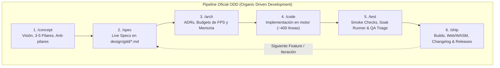
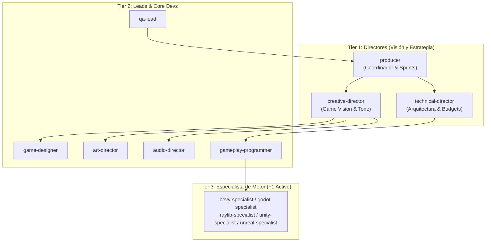
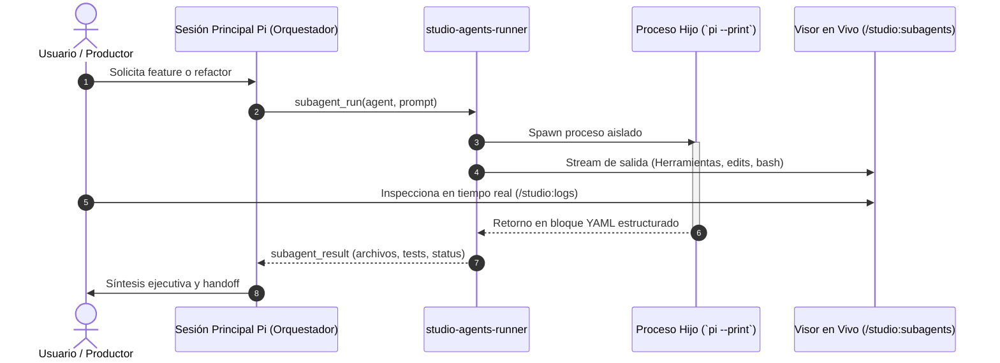
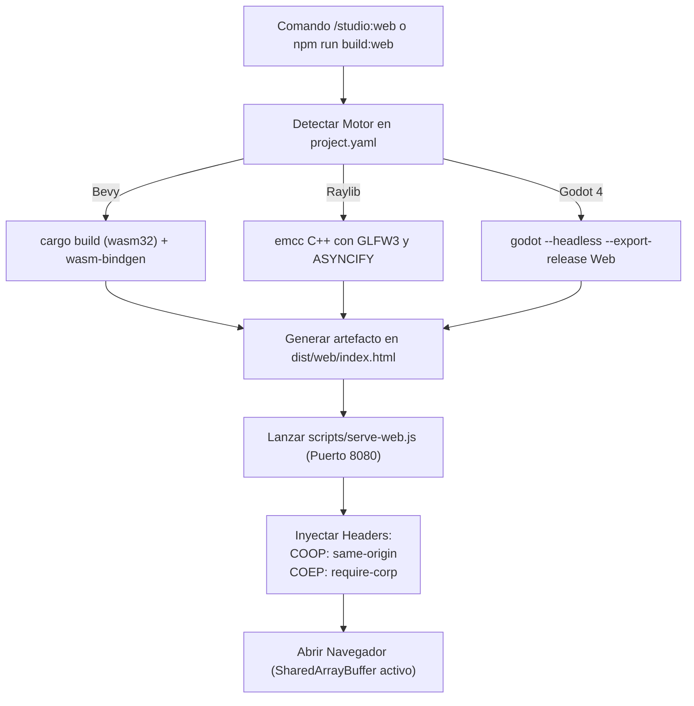
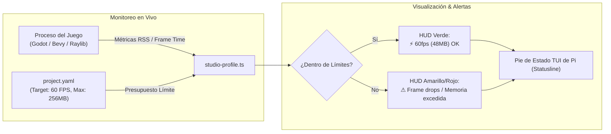
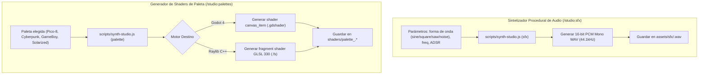
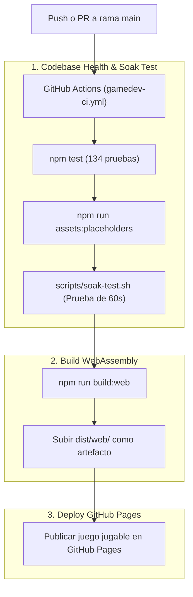

# Pi Game Studio — Arquitectura y Diagramas de Flujo (v1.4.0)

Este documento detalla los flujos de ejecución y las interacciones entre los componentes y herramientas de **Pi Game Studio**.

---

## 1. Pipeline ODD Gamedev (6 Fases Oficiales)

Flujo cíclico de desarrollo ágil que conecta diseño vivo, arquitectura técnica y validación continua en motor.

---

## 2. Gobernanza y Jerarquía de Agentes (Arquitectura 8+1)

Estructura compacta de directores, jefes de departamento y especialista dedicado del motor activo.

---

## 3. Subagentes Nativos Aislados y Streaming en Vivo

Ciclo de vida de una tarea delegada a un especialista en un proceso hijo no contaminante.

---

## 4. WebAssembly / Web One-Click Build & Runner (`/studio:web`)

Compilación cruzada a WASM y servidor con cabeceras de aislamiento multithreading (`COOP/COEP`).

---

## 5. Live Performance Profiler & Budget Tracker HUD (`/studio:profile`)

Monitoreo continuo de presupuestos de FPS, tiempos de cuadro y memoria RSS.

---

## 6. Sintetizador de Audio & Paletas de Shaders (`/studio:sfx` & `/studio:palettes`)

Generación procedural sin dependencias externas para prototipado rápido.

---

## 7. Pipeline de CI/CD Automatizado (GitHub Actions)

Validación continua en cada Pull Request y despliegue del juego a GitHub Pages.

